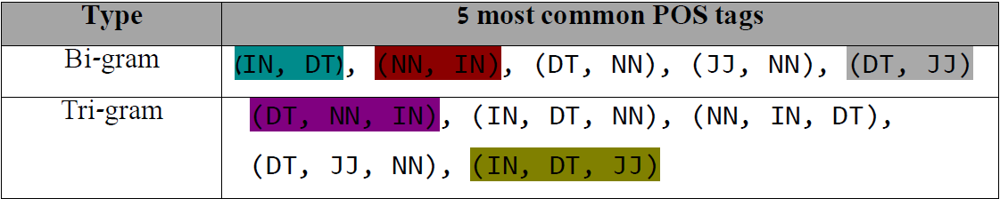
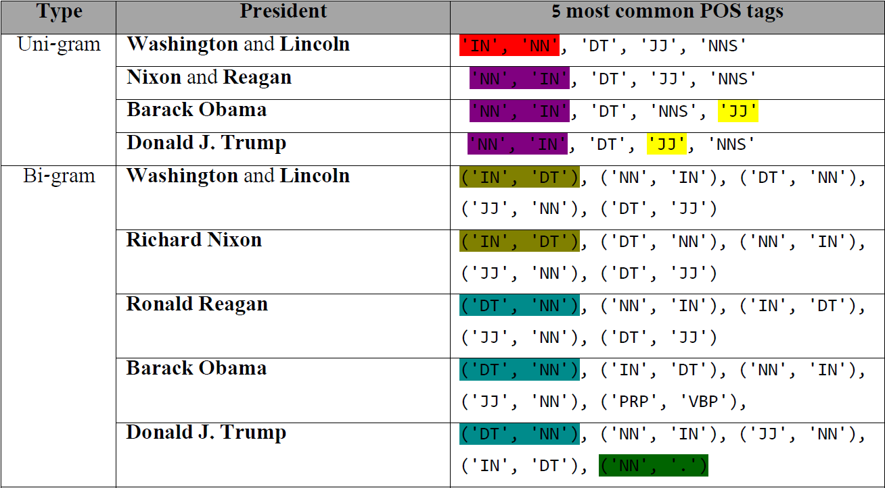
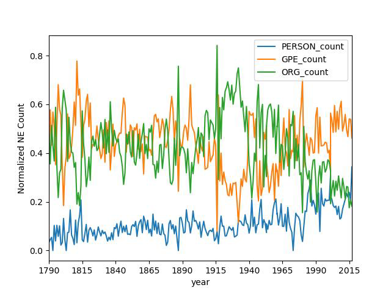
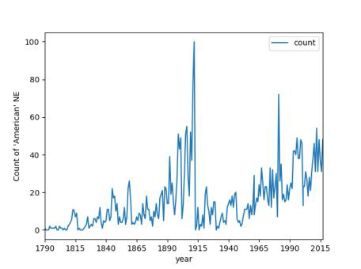

# POS_Tagging_and_Named_Entity_Recognition_on_the_American_State_of_the_Union_Addresses

General Information:
---------
* State of the Union (SOTU) is a major speech traditionally given by the President of the U.S. at the beginning of each calendar year.
* The president is addressing both houses (Congress and Senate) - reflecting on the achievements (and failures) of the passing year and outlining policy priorities for the coming year. 
* Content and style of the SOTU addresses vary along the years and depend on the shifting culture, the personality of the president and the challenges of the time. 

This Project:
---------
* This project focuses on comparing the distribution of POS and NE tags over time and presidents, in the U.S State of the Union Addresses.
The Python NLTK package is used for executing tagging modules (POS, NER) on the attached corpus.

Instructions:
---------
NLTK provides NER and POS tagging interfaces. In order to use the NLTK taggers the NLTK package has to be installed:
```python
pip install nltk 
```
and then download the nessecesary corpora:
```python
import nltk
nltk.download()
```

Examples of outputs:
---------
 - The five most common bigrams and trigram POS tags:
 For example, one of the most common bigram pos tags is (NN, IN) (as in "The **people in** America")
 Another example is the trigram (DT, NN, IN) (as in "the **constitution of the**")


- The five most common unigram and bigram POS tags, for each American president:


- The change in the use of different pos tags over the years:
We can see an increase in the use of more PERSON NE's in the last copule of years. This can indicate on political views change.


 - The change in the use of the entitiy **"American"** over the years:
 Again, we see an increse in the use of this unigram as a political named entity. 
 This can clearly be notice in president Trump's addressed, when he says - "believe, once more, in America".
 



